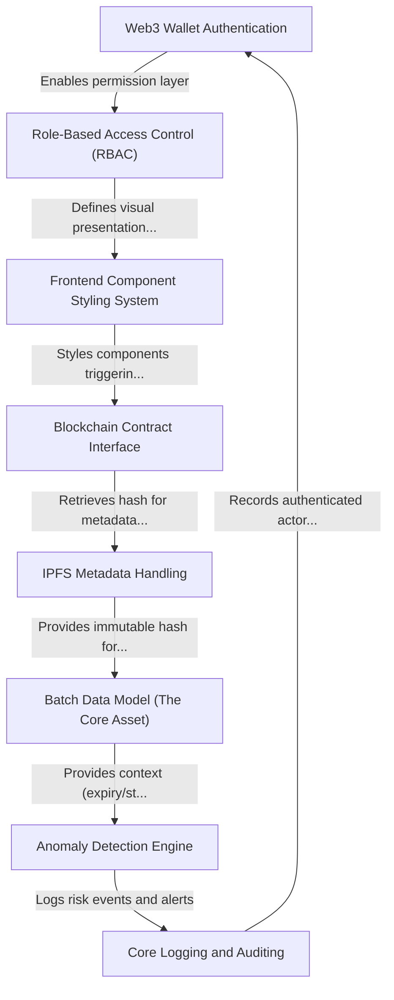

# Tutorial: satoshi-squad-yantra-2026

PharmaShield is a secure supply chain verification platform designed to combat pharmaceutical counterfeiting. It uses **Web3 Wallet Authentication** for identity and enforces fine-grained access via **Role-Based Access Control (RBAC)**. When *drug batches* are registered, immutable metadata is secured on **IPFS** and indexed on the Ethereum Sepolia blockchain via the **Blockchain Contract Interface**. Crucially, every verification scan is passed through an **Anomaly Detection Engine** which generates real-time security events captured in the **Core Logging and Auditing** system.

## Visual Overview

